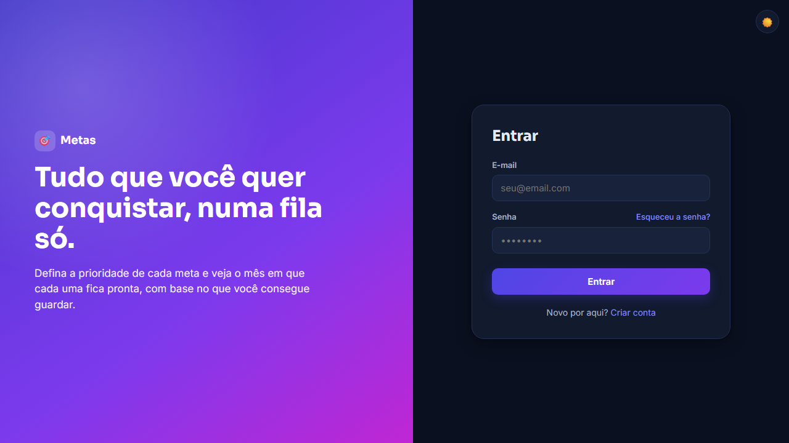

# Web Metas



Painel de metas financeiras em fila de prioridade. Em vez de dividir o dinheiro entre todas as metas ao mesmo tempo, o app assume que elas são pagas uma de cada vez, na ordem que você definir, e calcula em que mês cada uma começa e termina. A interface foi convertida de um design feito no Figma.

Site: https://web-metas.vercel.app

## O que tem

- Cadastro de metas com valor total, quanto já foi guardado, aporte mensal, categoria, prazo e imagem.
- Cronograma em linha do tempo, com aviso quando uma meta vai passar do prazo.
- Resumo no topo: total guardado, quanto falta, aporte por mês e quando tudo termina.
- Reordenar as prioridades arrastando ou pelas setas, com o cronograma recalculado na hora.
- Depósitos com histórico e gráfico de evolução de cada meta.
- Confete quando um depósito passa de 25%, 50% e 75% da meta e na conclusão, com o card da meta concluída exportado como imagem.
- Imagem da meta por link, upload ou busca no Unsplash.
- Link público só leitura pra compartilhar uma meta.
- Tema claro e escuro, layout pra celular e instalação como app (PWA).

## Tecnologias

JavaScript puro em módulos ES, sem framework, com o SDK compat do Firebase (Authentication e Firestore). Chart.js desenha o gráfico de evolução e html2canvas gera a imagem da meta concluída.

A busca no Unsplash passa por uma function da Vercel (`api/unsplash-search.js`), então a chave da API fica no servidor. A function só aceita texto de busca e só devolve imagens do próprio Unsplash.

As regras do Firestore (`firestore.rules`) deixam cada conta ler e gravar só as próprias metas e validam os campos de cada meta antes de gravar. Uma meta marcada como pública pode ser aberta pelo link, mas não aparece em listagem.

No build, o esbuild junta os módulos num arquivo só e o javascript-obfuscator embaralha esse arquivo. CSS e HTML saem minificados, e o service worker ganha uma versão nova a cada deploy. Quem abre o F12 no site publicado não vê o código legível.

## Estrutura

```
web-metas/
├── index.html
├── build.js               build de produção (gera dist/)
├── vercel.json
├── firestore.rules        regras de segurança do banco
├── firebase.json, .firebaserc
├── sw.js
├── manifest.json
├── api/
│   └── unsplash-search.js
├── css/
├── js/
│   ├── main.js            ponto de entrada
│   ├── auth.js            login, cadastro e recuperação de senha
│   ├── goals.js           painel, cronograma e meta pública
│   ├── planejamento.js    contas do cronograma, sem tela nem Firebase
│   ├── metas-db.js        acesso ao Firestore
│   ├── chart.js, celebrate.js, images.js, ui.js, state.js
│   └── firebase-config.js
├── scripts/servidor-dev.js servidor local
└── docs/capa.png          imagem deste README
```

## Rodando na sua máquina

```bash
npm install
npm run dev
```

A busca no Unsplash só funciona na Vercel ou com `vercel dev`, porque depende da function. Pra conferir o build de produção, rode `npm run build` e depois `npm run preview`.

O GitHub Actions roda o build a cada push, pra pegar erro de empacotamento antes da Vercel.

## Deploy na Vercel

Cadastre `UNSPLASH_ACCESS_KEY` nas variáveis de ambiente do projeto (a chave vem de unsplash.com/developers). Depois do primeiro deploy, adicione o domínio da Vercel em Firebase Console, Authentication, Settings, Domínios autorizados.

Pra publicar as regras do Firestore:

```bash
npx firebase-tools login
npx firebase-tools deploy --only firestore:rules
```

## Licença

Veja o arquivo LICENSE. As bibliotecas de terceiros estão em CREDITS.md.
